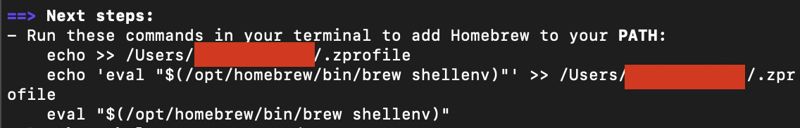

This guide explains how to install **FFmpeg**, **ImageMagick**, and **ExifTool** on macOS using [Homebrew](https://brew.sh/).

### Let's get started!

<Steps>

  <Step title="Step 1: Install Homebrew (if not already installed)">

    First, check if Homebrew is installed by running the following command in your terminal:
    ```bash
    brew --version
    ```
    Check out this video tutorial if you're not familiar with terminal.
      <iframe
        width="560"
        height="400"
        src="https://youtube.com/embed/eO71v88ECiQ"
        title="YouTube video player"
        frameborder="0"
        allow="accelerometer; autoplay; clipboard-write; encrypted-media; gyroscope; picture-in-picture"
        allowfullscreen
      ></iframe>


    If Homebrew is not installed, you can install it using the following command:
    ```bash
    /bin/bash -c "$(curl -fsSL https://raw.githubusercontent.com/Homebrew/install/HEAD/install.sh)"
    ```

    After installation, if you're prompted to add Homebrew to your system `PATH`, **copy the provided command** and run it with `sudo`. You may see something like this:

    

    like this but [you should copy it from the your terminal output of the previous command]
    ```
    sudo echo /Users/<your mac username>/.zprofile
    echo 'eval "$(/opt/homebrew/bin/brew shellenv)"' >> /Users/<your mac username>/.zprofile eval "$(/opt/homebrew/bin/brew shellenv)"
    ```

    It will ask for your login password and you're done with the brew installation.

    For more detailed instructions, visit the [Homebrew Installation Guide](https://brew.sh).

  </Step>
  
  <Step title="Step 2: Install FFmpeg, ImageMagick, and ExifTool">
    Once Homebrew is installed and correctly added to your system's `PATH`, you can install **FFmpeg**, **ImageMagick**, and **ExifTool** with the following command:
    ```bash
    brew install ffmpeg imagemagick exiftool
    ```

    FFmpeg is a powerful tool for working with video and audio, ImageMagick is used for image processing, and ExifTool helps manage media file metadata. This command will install all three utilities at once.

  </Step>
  
  <Step title="Step 3: Verify Installation">
    After the installation completes, verify that all tools are installed by checking their versions:
    ```bash
    ffmpeg -version
    magick -version
    exiftool -ver
    ```

    You should see version information for FFmpeg, ImageMagick, and ExifTool, confirming that they were installed successfully.

  </Step>
  
</Steps>

## You're All Set!

Now that **FFmpeg**, **ImageMagick**, and **ExifTool** are installed, you're ready to start using them in your projects!
