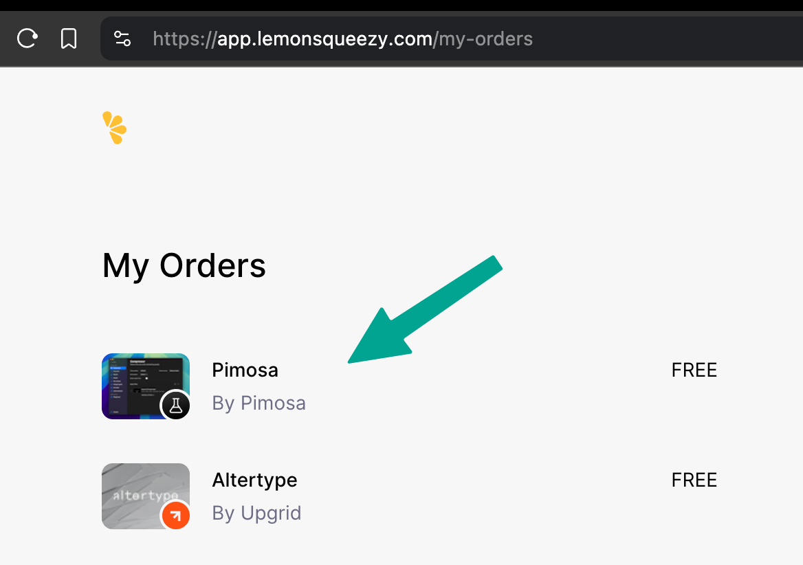
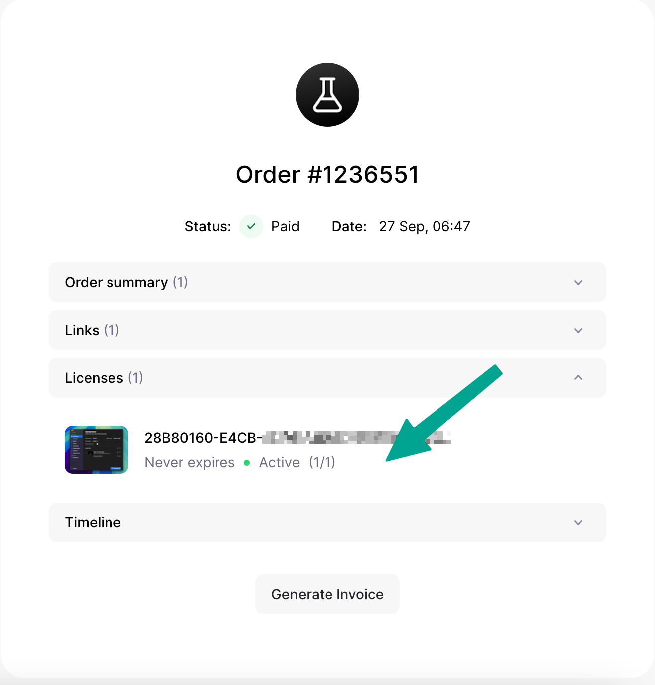
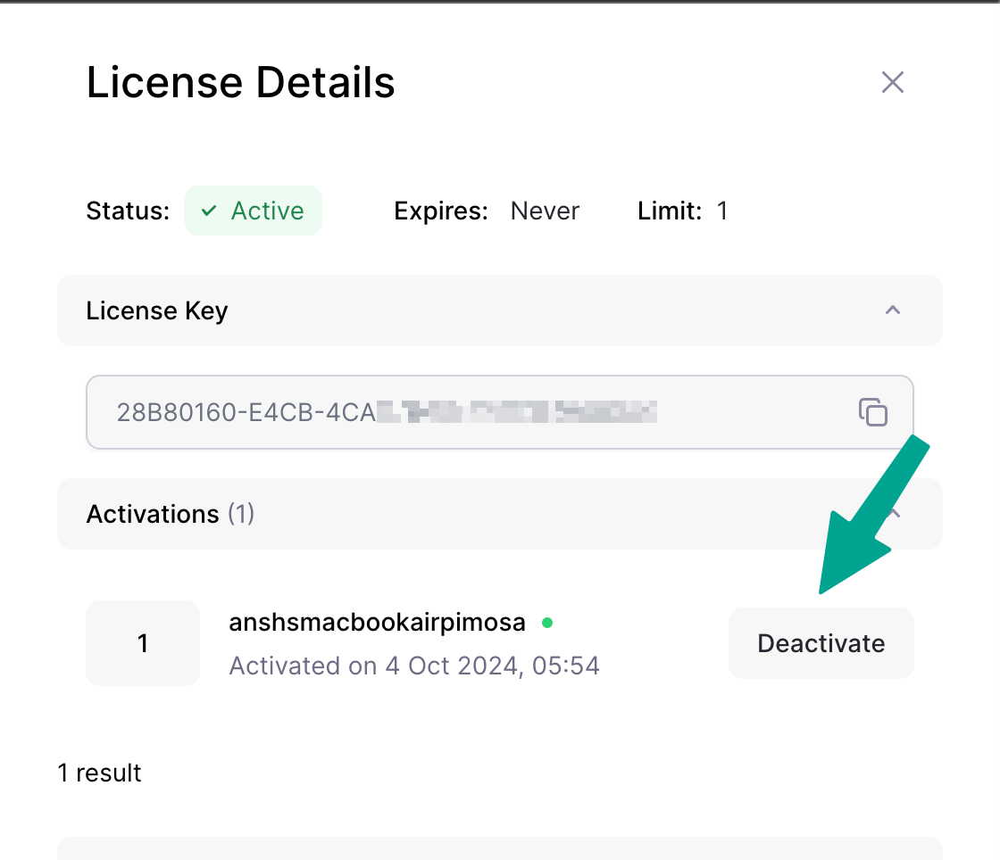

### Why this error occurs?

When user uninstalls app without unlinking the license key from the app, the license key stays activated on the previous version of the app. we can't unlink the license key automatically when user uninstalls apps so user has to do it manually from lemonsqueezy orders page.

### How to solve this error?

<Steps>
<Step title="First step">
Go to lemonsqueezy orders page using the link below

[https://app.lemonsqueezy.com/my-orders](https://app.lemonsqueezy.com/my-orders)
</Step>
<Step title="Second step">
Find out the "Pimosa" app and click on it

</Step>
<Step title="Third step">
 Find license tab and click on it
 
</Step>
<Step title="Fourth step">
it will open the license detials in sidebar or maybe in new page
</Step>
<Step title="Final step">
Click on the "deactivate" button

</Step>
</Steps>

Key is now deactivated and you can put the license key in the app it should work fine.