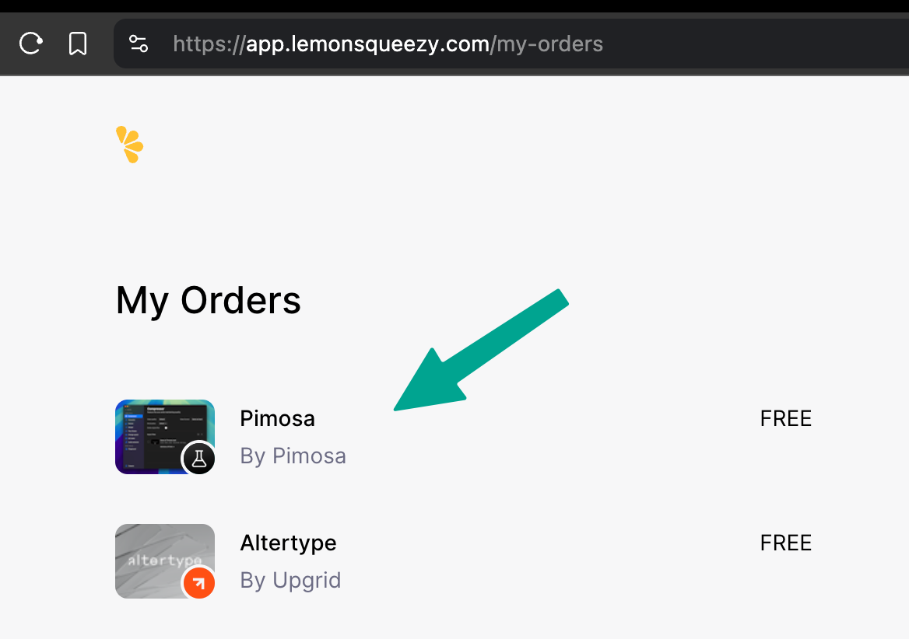
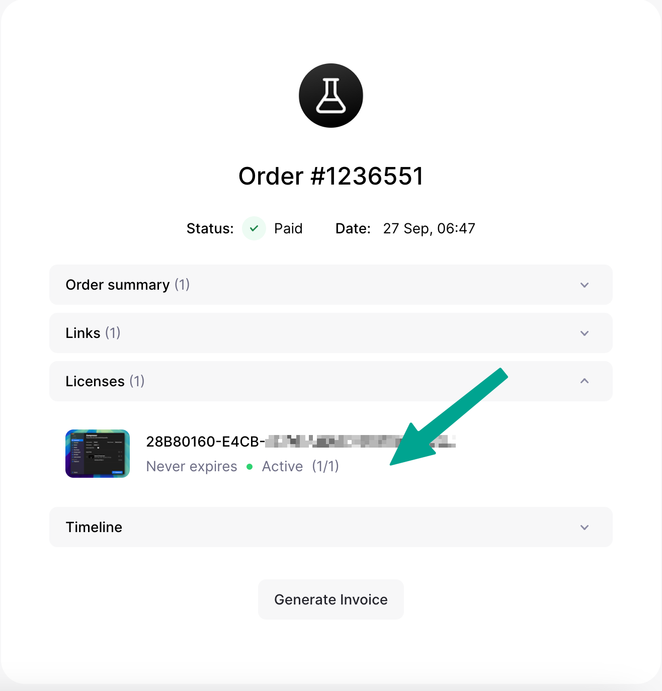

### How to find your license key?

After purchasing the license key you can always find your license key in your invoice email, but here is the another way to find it.

<Steps>
<Step title="First step">
Go to lemonsqueezy orders page using the link below

[https://app.lemonsqueezy.com/my-orders](https://app.lemonsqueezy.com/my-orders)

</Step>
<Step title="Second step">
Find out the "Pimosa" app and click on it

</Step>
<Step >
Find license tab and click on it to check the license details. 

 </Step>
</Steps>
